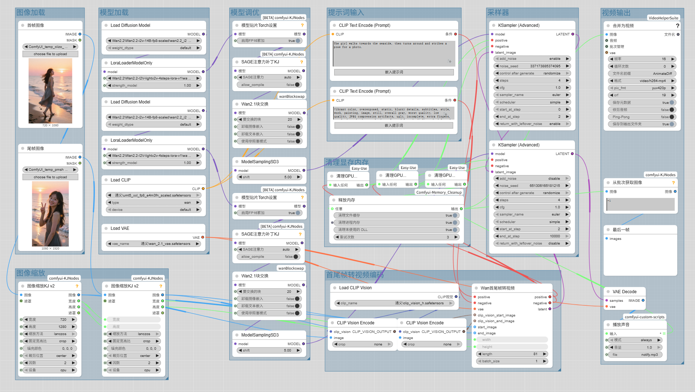

# 🐳 ComfyUI WanVideo Integrated KSampler

[](https://github.com/luguoli)
[](https://github.com/comfyanonymous/ComfyUI)

**English** | [简体中文](README.md)

WanVideoIntegratedKSampler

This is an integrated ComfyUI WanVideo generation sampler node. Compared to using the official K-sampler, it eliminates the messy connections, supporting both text-to-video and image-to-video generation. It integrates dual-model sampling for high and low noise, single-frame generation, start/end frame generation, automatic GPU/RAM memory cleanup, batch generation, various attention optimizations, and more. Moms no longer have to worry about messy connections~~~~

#### If this project helps you, please give it a ⭐Star — it lets me know there are humans out there using it!

## 🏆 Features

### 🎬 Supported Generation Modes
- **Text-to-Video**: Generate videos from text prompts
- **Image-to-Video**: Generate videos from a single reference image
- **Start/End Frame-to-Video**: Generate videos from start and end frame images

### ⚡ Advanced Optimizations
- **Dual-Stage Model Sampling**: Integrated high and low noise dual-stage model sampling with configurable parameters for each stage
- **Separate High/Low Noise Settings**: Configure sampling steps and CFG values for high and low noise stages respectively
- **Sage Attention Optimization**: Integrated multiple attention optimization modes supporting memory-efficient computation
- **FP16 Accumulation**: Support Torch FP16 accumulation to improve VRAM utilization
- **SD3 Sampling Integration**: Integrated SD3 sampling algorithm, no additional nodes needed

### 🖼️ Image Processing
- **Integrated Prompt Input**: Integrated prompt input box, no additional nodes needed
- **Automatic Image Scaling**: Automatically scales to target dimensions while maintaining aspect ratio
- **Direct Video Frame Retrieval**: Obtain video frame sequences directly, no additional decoding required
- **Last Frame Retrieval**: Obtain the last frame of generated video directly, no additional processing needed

### 🔧 Productivity Enhancer
- **Batch Generation**: Generate multiple videos in a single operation
- **Automatic GPU Memory Cleanup**: Automatic cleanup option for GPU/VRAM
- **Automatic RAM Memory Cleanup**: Automatic cleanup option for RAM
- **CLIP Vision Enhancement**: Support CLIP Vision model for enhanced perspective control
- **Completion Sound Notification**: Play audio alert upon completion

### 📦 Other
- **Simple Version Provided**: Includes only dual-model sampling integration for advanced custom use

## 🍧 Comparison Demo
### 🔄 Workflow Complexity Comparison
- **❌ Workflow without WanVideo Integrated KSampler (complex, many nodes, many connections, two samplers)**

- **✅ Workflow with WanVideo Integrated KSampler (ultra-simple, single node, almost no connections, single sampler)**


## 📦 Installation

### Method 1: Via ComfyUI Manager (Recommended)
1. Open ComfyUI Manager in ComfyUI interface
2. Search for "ComfyUI-Wan-Video-Integrated-KSampler"
3. Click Install

### Method 2: Manual Installation
1. Navigate to your ComfyUI custom nodes directory:
   ```bash
   cd /path/to/ComfyUI/custom_nodes
   ```

2. Clone the repository:
   ```bash
   git clone https://github.com/luguoli/ComfyUI-Wan-Video-Integrated-KSampler.git
   Or Gitee repository:
   git clone https://gitee.com/luguoli/ComfyUI-Wan-Video-Integrated-KSampler.git
   ```

3. Install dependencies:
   ```bash
   pip install -r requirements.txt
   ```

4. Restart ComfyUI

## 🚀 Usage

### [Workflow Example](video_workflow_example.json)

### Basic Text-to-Video Generation

1. Add the "🐳 WanVideo Integrated KSampler" node to your workflow
2. Connect the required inputs:
   - 🔥 High Noise Model
   - ❄️ Low Noise Model
   - 🟡 CLIP
   - 🎨 VAE
3. Input positive and negative prompts
4. Set relevant parameters:
   - Set video frame length, width, height
   - Configure sampling steps and CFG values for high/low noise
   - Set batch size, seed, etc.
5. Execute the workflow

### Image-to-Video Generation

1. Add the node to the workflow
2. Connect required inputs:
   - 🔥 High Noise Model
   - ❄️ Low Noise Model
   - 🟡 CLIP
   - 🎨 VAE
3. Connect at least one reference image:
   - 🖼️ Start Image
   - 🖼️ End Image
4. Optionally connect 👁️ CLIP Vision for enhanced control
5. Input positive/negative prompts
6. Configure other parameters
7. Execute the workflow

## ⚠️ Notes

### 📝 Usage Requirements
- **Text-to-Video Mode**: No reference images needed, pure text prompts
- **Image-to-Video Mode**: At least one reference image required, start/end frames can be combined for precision control

### 🎛️ Parameter Recommendations
- **Frame Length**: Adjust based on GPU memory, start testing from 41 frames
- **Resolution**: Must be multiples of 8, start testing from 720x1280
- **Batch Size**: Choose between 1-10, adjust based on GPU memory
- **Sampling Steps**: Start testing from 4
- **CFG Value**: Default 1.0, recommended range 0.5-7.0
- **FP16 Accumulation**: Recommended to enable
- **Sage Attention**: Recommended to set to auto
- **SD3 Shift**: Recommend setting to 5

### 💾 Memory Management
- **GPU Memory Cleanup**: Enable enable_clean_gpu_memory to automatically clean VRAM before/after sampling
- **CPU Memory Cleanup**: Enable enable_clean_cpu_memory_after_finish to clean RAM after completion (includes file cache, processes, dynamic libraries),During continuous large-scale generation, always enable memory cleanup options to prevent memory overflow

### 🔊 Notification Function
- **Sound Notification**: Only supported on Windows systems

### 📞 Contact for Special Customization 📞
- Author: @luguoli（墙上的向日葵）
- Author Email: luguoli@vip.qq.com

## 📝 Update Log
### v1.0.1:
- **Added translation script:** Starting from ComfyUI v0.3.68, Chinese language files became invalid. Added an automatic translation script. Double-click [自动汉化节点.bat] and restart ComfyUI. Requires ComfyUI-DD-Translation plugin to be installed.
- **Removed block swap settings:** Latest ComfyUI version blocks block swapping, so this setting has been removed.

---

**Made with ❤️ for the ComfyUI community**
