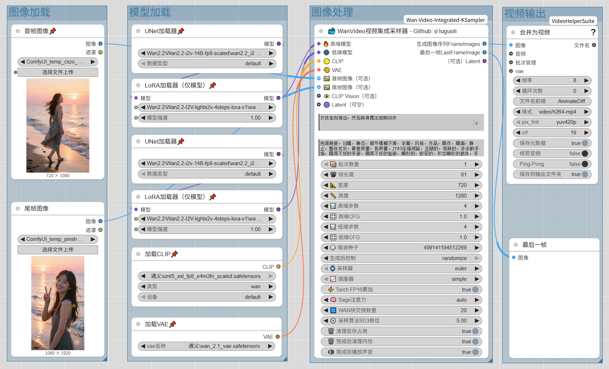

# 🐳 ComfyUI 万相视频WanVideo集成采样器（Wan Video Integrated KSampler）

[](https://github.com/luguoli)
[](https://github.com/comfyanonymous/ComfyUI)

[English](README-en.md) | **简体中文**

WanVideoIntegratedKSampler

这是一个集成化的ComfyUI 通义万相 WanVideo 视频生成功能采样器节点，相比使用官方的K采样器，告别原版乱七八糟的连线，同时支持文生视频和图生视频生成，集成了高噪和低噪双模型采样、单图生成、首尾帧生成、显存/内存自动自动清理、批量生成、多种注意力优化等全面优化功能，妈妈再也不用担心我连线乱七八糟了~~~~

#### 如果这个项目对您有帮助，请点个 ⭐Star 吧，让我知道世界上还有人类在使用它！

## 🏆 特色功能

### 🎬 支持生成模式
- **文生视频**: 从文本提示生成视频
- **单图生成视频**: 基于单张参考图像生成视频
- **首尾帧生成视频**: 基于首尾帧两张图像生成视频

### ⚡ 高级优化
- **双阶段模型采样**: 集成高噪和低噪双阶段模型采样，支持不同阶段的采样参数配置
- **高低噪分步设置**: 分别设置高噪和低噪的采样步数、CFG值
- **Sage注意力优化**: 集成多个注意力优化模式，支持内存高效计算
- **FP16累加**: 支持torch FP16累加提高显存利用率
- **采样算法（SD3）集成**: 集成了采样算法（SD3），无需另外连线

### 🖼️ 图像处理
- **提示词输入框集成**: 集成了提示词输入框，无需另外连线
- **自动图像缩放**: 自动在调整到目标尺寸的同时保持纵横比
- **直接获取结果视频序列帧**: 生成后可以直接获取视频序列帧，无需另外解码
- **获取结果视频最后一帧**: 生成后可以直接获取视频最后一帧，无需另外处理

### 🔧 提高生产力
- **批量生成**: 在单次操作中生成多个视频batch
- **自动显存清理**: GPU/VRAM显存的自动清理选项
- **自动内存清理**: RAM内存的自动清理选项
- **CLIP视觉编码**: 支持CLIP Vision模型增强视角控制
- **完成声音通知**: 生成完成后播放音频提醒

### 📦 其他
- **另外提供简单版**: 仅集成高噪和低噪双模型采样，方便高级自定义使用

## 🍧 对比展示
### 🔄 工作流复杂度对比
- **❌ 未使用【万相视频WanVideo集成采样器】的工作流（复杂繁琐，超多节点，超多连线，双采样器）**

- **✅ 使用了【万相视频WanVideo集成采样器】的工作流（极简，单节点搞定，几乎无连线，单采样器）**


## 📦 安装方法

### 方法1: 通过ComfyUI管理器（推荐）
1. 在ComfyUI界面中打开ComfyUI管理器
2. 搜索 "ComfyUI-Wan-Video-Integrated-KSampler"
3. 点击安装

### 方法2: 手动安装
1. 导航到您的ComfyUI自定义节点目录：
   ```bash
   cd /path/to/ComfyUI/custom_nodes
   ```

2. 克隆仓库：
   ```bash
   git clone https://github.com/luguoli/ComfyUI-Wan-Video-Integrated-KSampler.git
   或 Gitee 仓库：
   git clone https://gitee.com/luguoli/ComfyUI-Wan-Video-Integrated-KSampler.git
   ```

3. 安装依赖项：
   ```bash
   pip install -r requirements.txt
   ```

4. 重启ComfyUI

## 🚀 使用方法

### [工作流示例](video_workflow_example.json)

### 基础文生视频生成

1. 将"🐋 万象视频集成采样器"节点添加到工作流中
2. 连接必需输入：
   - 🔥 高噪模型
   - ❄️ 低噪模型
   - 🟡 CLIP
   - 🎨 VAE
3. 输入正向和负向提示词
4. 设置相关参数：
   - 设置视频帧数(length)、宽度(width)、高度(height)
   - 配置高噪和低噪的采样步数、CFG值
   - 设置批次大小、种子等参数
5. 执行工作流


### 图生视频生成

1. 将节点添加到工作流中
2. 连接必需输入：
   - 🔥 高噪模型
   - ❄️ 低噪模型
   - 🟡 CLIP
   - 🎨 VAE
3. 至少连接一张参考图像：
   - 🖼️ 首帧图像
   - 🖼️ 尾帧图像
4. 可选连接👁️ CLIP Vision增强控制
5. 输入正向/负向提示词
6. 配置其他参数
7. 执行工作流


## ⚠️ 注意事项

### 📝 使用要求
- **文生视频模式**：无需参考图像，直接输入文本提示
- **图生视频模式**：至少需要提供一张参考图像，可组合首/尾帧进行精确控制

### 🎛️ 参数设置建议
- **帧数（Length）**：根据GPU内存调整，建议从41帧开始测试
- **分辨率（Width/Height）**：须为8的倍数，建议从720x1280开始测试
- **批次大小（Batch Size）**：1-10之间选择，根据GPU内存调整
- **采样步数**：建议从4开始测试
- **CFG值**：默认1.0，推荐0.5-7.0范围
- **FP16累加**: 建议开启
- **Sage注意力优化**: 建议设置为自动
- **采样算法（SD3）移位**: 建议设置为5


### 💾 内存管理
- **GPU内存清理**：启用enable_clean_gpu_memory选项，在生成前/后自动清理VRAM
- **CPU内存清理**：启用enable_clean_cpu_memory_after_finish，生成结束后清理RAM（包含文件缓存、进程、动态库），连续大量生成时建议始终启用内存清理选项以防止内存溢出

### 🔊 通知功能
- **声音通知**：仅在Windows系统支持


## 📝 更新记录
### v1.0.1：
- **增加汉化脚本：** ComfyUI从v0.3.68开始中文语言文件失效，增加自动汉化脚本，双击执行【自动汉化节点.bat】后重启ComfyUI即可，需要安装ComfyUI-DD-Translation插件
- **移除块交换设置：** ComfyUI最新版本已阻止块交换，移除此设置


## 📞 需要特别定制请联系 📞 
- 作者：@luguoli（墙上的向日葵）
- 作者邮箱：luguoli@vip.qq.com

---

**用❤️为ComfyUI社区制作**
